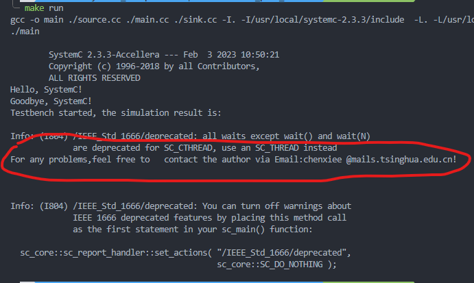

# 关于这个样例

提供一个简单的，使用了接口、端口、通道这三个概念的runnable demo，帮助理解这三个概念

这个DEMO简介：

信源(source)和信宿(sink)通过FIFO通道发送一个字符串“For any problems,feel free to contact the author via Email:chenxiee @mails.tsinghua.edu.cn!\n”

我曾经的一点小疑问：这个发送字符和接收字符的操作应该要有握手信号来保证数据传输同步啊，我的DEMO里并没有实现握手信号，为什么每次跑出来结果都是同步的、没有出差错的呢？

回答：这里是因为使用的FIFO通道本身有缓存功能，不需要握手信号来帮助同步

注意：运行时，打印字符串的结果可能没那么容易找到, 如下图

可以看到，字符串 “For any problems,feel free to contact the author via Email:chenxiee @mails.tsinghua.edu.cn!\n” 被包裹在了一堆"deprecated"信息中。

---

## 学到的东西

1.sc_start() 可以加两个参数，它们的意义分别是？

回答：根据 SystemC_Reference_Manual "4.3.4.2 Function sc_start" 可知，sc_start(100, SC_NS); 的含义是让模拟运行100ns

2.构建硬件模块有两种方式，一种是使用SC_MODULE, 另一种是使用 class Top: public sc_module

3.模块的构造函数可以加第二个参数，它的意义是？

回答：在使用 class Top: public sc_module 方式构建模块时，构造函数可以像C++一样指定数量和类型，还可以在实例化这个模块的时候给构造函数传入更多参数。

4.sc_in_clk 和 sc_clock的区别是什么？

回答：根据SystemC手册6.7.8, sc_in_clk实际上就是sc_in\<bool>，命名成这样只是单纯为了提高可读性，一般用于添加时钟信号。sc_in_clk通常用在SystemC的早期版本中, 现在保留这个语法只是为了向后兼容。sc_clock是更新版本SystemC提供的时钟信号。

5.SC_HAS_PROCESS有啥用？

回答：根据手册5.2.8，宏SC_CTOR包含了宏SC_METHOD，SC_THREAD和SC_CTHREAD的定义。相同的定义也被包含在宏SC_HAS_PROCESS里。如果在定义硬件模块的时候，没有使用SC_CTOR，而又要使用之前提到的那些Processes，那么就需要调用SC_HAS_PROCESS

那么，什么情况下不使用SC_CTOR而使用SC_HAS_PROCESS呢？根据手册5.2.7，可知使用SC_CTOR的时候，用户无法对模块的构造函数的参数列表进行定制化。因此，如果我们的硬件模块构造函数需要我们自己定义的参数，那么就不使用SC_CTOR而使用SC_HAS_PROCESS。

6.SystemC手册经常用Macro来描述SC_CTOR, SC_HAS_PROCESS这些东西，看来它们是C语言宏无疑了。

7.所有的wait函数，除了wait()和wait(N)，在IEEE_Std_1666之后都已经被废弃了

8.使用FIFO通道不需要在发信和收信模块之间实现握手信号，因为FIFO本身有缓存功能，不需要握手信号来支持数据同步

9.SystemC中可以直接调用rand()函数来获取随机数

---
